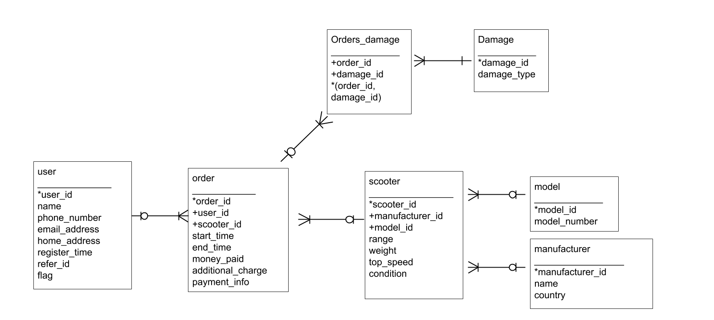

# Homework 05

## Scoot-Share

design decisions:

I decided to create the seven big data table: 
1. user
2. order
3. scooter
4. model
5. manufacturer
6. orders_damage
7. damage

Assumptions:
I assume that each scooter only have 1 model and 1 manufacturer.
Assume that each person could have 0 or more orders. 
Assume that the weight/top speed/range of scooters only depend on itself. That's to say, scooters with same model and manufacturer could have differnt top speed/range/weight.
Each scooter can have different types of damage and it is possible that a scooter doesn't have any damage.
I assume that only 1 scooter can ba assigned to each order at each time, and only one people could be registered to start a new rent order.

Scripts

* [part-1-scoot-share-create.sql](part-1-scoot-share-create.sql)
* [part-1-scoot-share-queries.sql](part-1-scoot-share-queries.sql)

## Normalization

* [part-2-normalization-create.sql](part-2-normalization-create.sql)
* [part-2-normalization-import.sql](part-2-normalization-import.sql)
* [part-2-normalization-import.py](part-2-normalization-import.py)
* [part-2-normalization-queries.sql](part-2-normalization-queries.sql)
